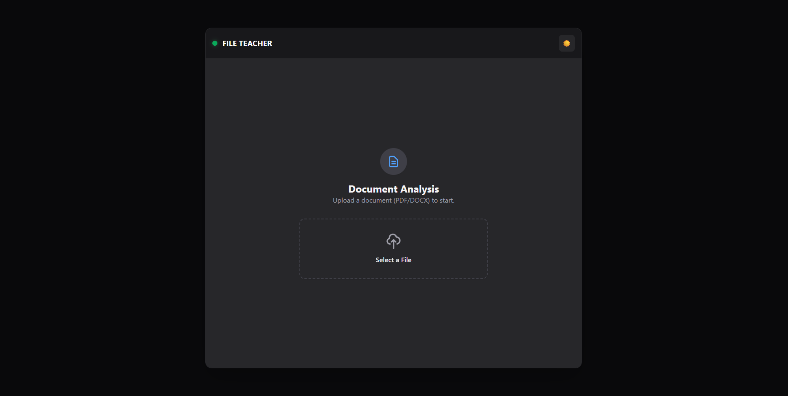

# File_Teacher
A localized Retrieval-Augmented Generation (RAG) system for secure document inference.

## 1. Project Overview
File_Teacher is an integrated software solution designed to facilitate secure, local-first interaction with unstructured data. The system utilizes a Retrieval-Augmented Generation (RAG) architecture to transform static documents into a queryable knowledge base. Unlike conventional cloud-based AI solutions, this project prioritizes data sovereignty and privacy by executing the entire inference and embedding pipeline on local hardware. The core objective is to mitigate hallucinations in large language models by grounding responses in verified, user-provided context.

## 2. Technological Framework
The system is built upon a decoupled microservices architecture to ensure scalability and separation of concerns. The user interface is developed with React, providing a responsive environment for document management. The orchestration layer is powered by FastAPI, which manages the communication between the vector storage and the inference engine.

For the retrieval mechanism, the system employs ChromaDB as the high-dimensional vector database, utilizing the sentence-transformers/all-minilm-l6-v2 model for generating semantic embeddings. The language model inference is handled by Ollama, specifically running the Mistral 7B model. To maintain high performance during computationally intensive operations, an asynchronous task queue managed by Celery and Redis is implemented to handle document parsing and embedding generation.

## 3. Architectural Design and Data Pipeline
The data lifecycle within File_Teacher begins with a multi-stage ingestion process. When a document is submitted, the FastAPI backend delegates the processing to a Celery worker, ensuring that the main application remains responsive. The worker performs text extraction and semantic chunking, followed by a vectorization process where text segments are mapped into a continuous vector space. These vectors are subsequently indexed within ChromaDB.

During the query phase, the system performs a similarity search to retrieve the most relevant document segments based on the user's input. These segments are then formatted as context and provided to the Mistral model. This methodology ensures that the model’s output is strictly derived from the provided document, significantly increasing the reliability of the information provided in a research or professional context.

## 4. Engineering Challenges and Resolutions
Developing a fully containerized RAG system required overcoming several non-trivial engineering obstacles. A primary challenge involved the synchronization of file I/O operations between the FastAPI server and the Celery worker. Because these services operate in isolated environments, a shared volume strategy was implemented within Docker to ensure that the worker could access uploaded binaries immediately after the POST request was completed.

Furthermore, integrating a local LLM into a Dockerized network required specialized configuration of the Ollama service to allow internal requests. By configuring the system to use internal Docker DNS, the application achieves a "zero-dependency" state where the software can be deployed on any machine with Docker installed, without requiring pre-configured host environments or external API keys.

5. Installation and Deployment
The project is designed for immediate deployment using Docker Compose. All environment configurations, including service URLs and model parameters, are pre-defined within the orchestration files to eliminate the need for manual configuration.

To initialize the system for the first time, execute the following command in the project root:

```bash
docker-compose up --build -d
```

Note: The initial setup includes image construction and automated model retrieval. Depending on your hardware specifications and network bandwidth, this process may require approximately 10 to 15 minutes.

Subsequent executions utilize cached images and persistent volumes, allowing for near-instant startup without rebuilding the entire infrastructure:

```bash
docker-compose up -d
```

Once the model is loaded, the application is accessible via the frontend service on port 5173. The system is optimized for environments with at least 8GB of dedicated RAM to ensure stable inference performance.

6. Future Development and Scalability
The current iteration of File_Teacher serves as a foundation for further research into localized AI. Future enhancements include the implementation of hybrid search algorithms, combining semantic vector retrieval with traditional BM25 keyword matching to improve precision for technical terminology. Additionally, there are plans to introduce multi-modal capabilities, allowing the system to interpret visual data within documents, such as architectural diagrams or financial charts, through vision-language models.